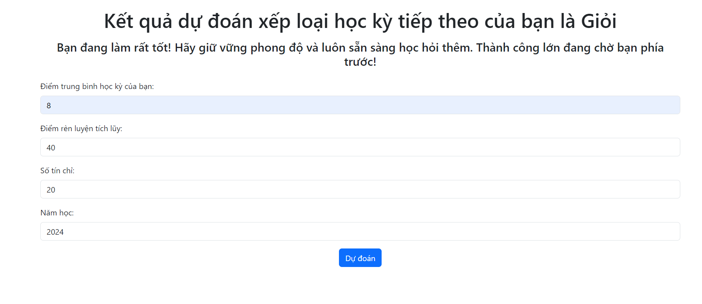

# Web Dự Án Dự Đoán Kết Quả Học Tập

Đây là một ứng dụng web được xây dựng bằng Python (sử dụng Flask) để dự đoán kết quả học tập của sinh viên UIT dựa trên các yếu tố như điểm trung bình học kỳ trước, điểm rèn luyện tích lũy và số tín chỉ đã học.



## Mục Lục
- [Giới thiệu](#giới-thiệu)
- [Cài Đặt](#cài-đặt)
- [Cách Sử Dụng](#cách-sử-dụng)
- [Tính Năng](#tính-năng)
- [Ghi Chú](#ghi-chú)

## Giới Thiệu

Đây là web giúp dự đoán kết quả học tập của sinh viên UIT trong kỳ học tiếp theo. Các yếu tố dựa vào bao gồm:
- Điểm trung bình học kỳ trước.
- Điểm rèn luyện tích lũy.
- Số tín chỉ đã hoàn thành.
- Năm học 

Ứng dụng sẽ phân loại kết quả học tập của sinh viên thành các mức: Giỏi, Khá, Trung Bình và Yếu. Và cho những lời động viên tương ứng.

## Tính Năng

- **Dự đoán xếp loại học kỳ tiếp theo**: Ứng dụng dựa trên các dữ liệu đầu vào như điểm trung bình học kỳ trước, điểm rèn luyện tích lũy và số tín chỉ đã học để dự đoán kết quả học tập.
- **Giao diện đơn giản và dễ sử dụng**: Giao diện người dùng thân thiện với các trường nhập liệu rõ ràng.
- **Đáp ứng nhanh**: Kết quả dự đoán được trả lại ngay lập tức sau khi nhập dữ liệu.

## Cài Đặt

Để cài đặt và chạy ứng dụng, làm theo các bước sau:

1. **Clone repository**:
    ```bash
    git clone https://github.com/bleenee203/IS353.P12_Nhom3.git
    cd your-repository
    ```

2. **Cài đặt các thư viện yêu cầu**:
    Đảm bảo rằng bạn đã cài đặt Python, sau đó cài đặt các thư viện yêu cầu từ file `requirements.txt`:
    ```bash
    pip install -r requirements.txt
    ```

3. **Chạy ứng dụng**:
    Để khởi động ứng dụng, sử dụng lệnh sau:
    ```bash
    python app.py
    ```
    Ứng dụng sẽ chạy trên `http://127.0.0.1:5000/`.

## Cách Sử Dụng

1. Mở ứng dụng web tại `http://127.0.0.1:5000/` trong trình duyệt.
2. Nhập các thông tin cần thiết vào các trường:
    - Điểm trung bình học kỳ trước.
    - Điểm rèn luyện tích lũy.
    - Số tín chỉ.
    - Năm học.
3. Nhấn nút **Dự đoán** để nhận kết quả xếp loại học tập.

## Ghi Chú

- Ứng dụng có thể được mở rộng với các tính năng dự đoán phức tạp hơn nếu cần.
- Các mô hình dự đoán có thể được cải thiện và huấn luyện lại nếu có thêm dữ liệu.
